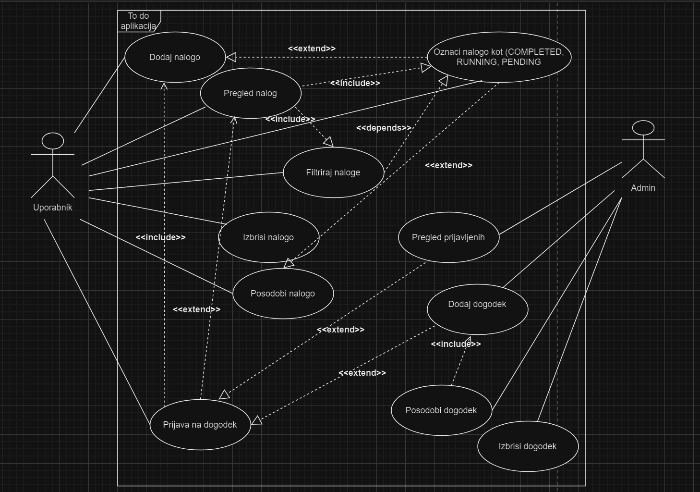

### Namen aplikacije

To-Do aplikacija je namenjena širokemu spektru uporabnikov, vključno z zaposlenimi, študenti, in vsakomur, ki želi izboljšati svoje veščine upravljanja s časom in optimizirati vsakodnevne naloge.

### Izboljšanje uporabniške izkušnje

- Naša To-Do aplikacija se osredotoča na reševanje pogostih izzivov, s katerimi se uporabniki srečujejo, kot sta preobremenjenost s številnimi nalogami in pozabljanje pomembnih rokov. Aplikacija ponuja preprost in intuitiven postopek organizacije nalog ter napredne funkcionalnosti za upravljanje časa, kar uporabnikom omogoča učinkovito obvladovanje vsakdanjih obveznosti.

### Cilji

- Povečanje produktivnosti: Aplikacija omogoča uporabnikom, da hitro ustvarijo in razvrstijo naloge, kar jim pomaga pri boljši organizaciji dela in prioritet.
- Preprečevanje pozabljanja: Z možnostjo nastavljanja opomnikov uporabniki nikoli ne pozabijo na pomembne roke in naloge.
- Enostavna uporaba: Intuitiven uporabniški vmesnik zagotavlja enostavno navigacijo, kar uporabnikom omogoča hitro prilagajanje aplikaciji.

### Besednjak

- **Aplikacija To-Do**: Spletna aplikacija za organizacijo nalog, ki omogoča uporabnikom dodajanje, urejanje, označevanje kot zaključeno, in brisanje nalog. Omogoča izboljšanje produktivnosti in boljše upravljanje časa.

- **Frontend**: Del aplikacije, ki se prikazuje uporabniku. Razvit v React-u s pomočjo Vite, ponuja uporabniški vmesnik za interakcijo z nalogami.

- **Backend**: Spletna storitev v Spring Boot-u, ki vsebuje logiko aplikacije, obdeluje podatke in upravlja MySQL bazo podatkov.

- **MySQL**: Relacijska baza podatkov, kjer so shranjeni podatki o nalogah, uporabnikih in drugih podrobnostih aplikacije.

- **Vite**: Razvojno okolje za hitro ustvarjanje in izvajanje React aplikacij.

- **IntelliJ IDEA**: Integrirano razvojno okolje (IDE) za razvoj backend-a v Javi.

- **REST API**: Zbirka končnih točk, ki omogoča komunikacijo med frontend-om in backend-om. S pomočjo metod HTTP omogoča dostop do podatkov in funkcij aplikacije.

- **Task** (naloga): Osnovna entiteta aplikacije To-Do, ki predstavlja naloge, ki jih uporabnik lahko dodaja, ureja in briše.

- **CRUD Operacije**: Osnovne operacije aplikacije, ki vključujejo ustvarjanje (Create), branje (Read), posodabljanje (Update) in brisanje (Delete) nalog.

### Diagram primerov uporabe

