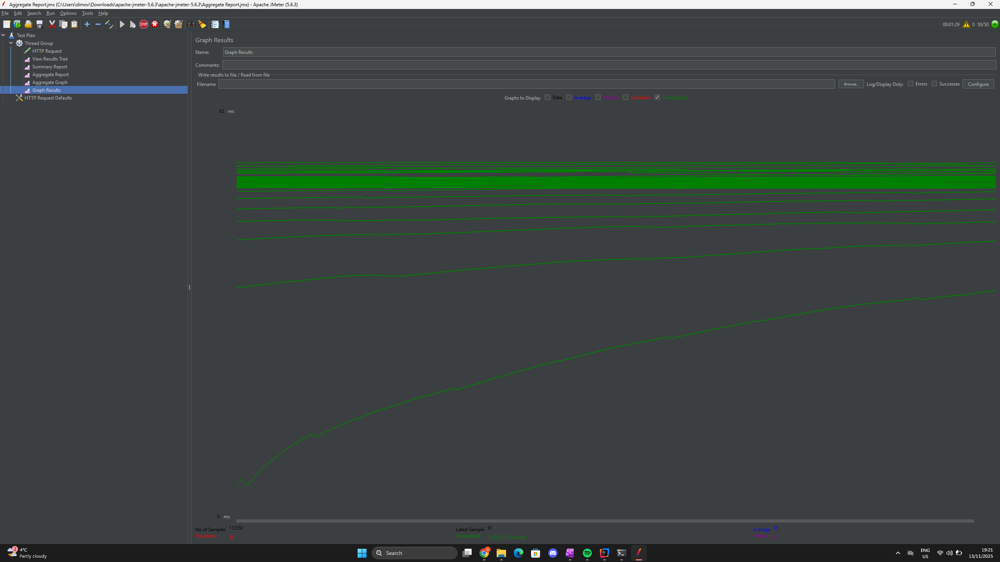

# Poročilo o obremenitvenem testiranju
## GET Tasks Endpoint

### 1. Uvod

Izvedeno je bilo obremelitveno testiranje za GET tasks endpoint z uporabo Apache JMeter orodja. Namen testiranja je bil evalvirati zmogljivost in odzivnost sistema pod obremenitvijo ter določiti ključne performance metrike.

### 2. Konfiguracija testiranja

**Parametri testa:**
- **Število uporabnikov (threads):** 50
- **Čas naraščanja (ramp-up time):** 10 sekund
- **Endpoint:** GET /api/users/9/tasks
- **Orodje:** Apache JMeter GUI (verzija 5.6.3)
- **Skupno število zahtevkov:** 40,000

**Testni scenarij:**
Simuliranih je bilo 50 sočasnih uporabnikov, ki so bili postopoma dodani v časovnem obdobju 10 sekund. Vsak uporabnik je izvedel večkratne zahtevke do endpointa.

### 3. Rezultati testiranja

#### 3.1 Ključne metrike (Summary Report)

| Metrika | Vrednost |
|---------|----------|
| **Skupno število zahtevkov** | 40,000 |
| **Povprečni odzivni čas** | 36 ms |
| **Minimalni odzivni čas** | 2 ms |
| **Maksimalni odzivni čas** | 1099 ms |
| **Standardna deviacija** | 42.90 ms |
| **Stopnja napak** | 0.00% |
| **Prepustnost** | 1212.5/sec |
| **Prejeti podatki** | 514.22 KB/sec |
| **Poslani podatki** | 152.65 KB/sec |

#### 3.2 Agregatni rezultati (Aggregate Report)

**Percentili odzivnih časov:**
- **90% Line (90. percentil):** 84 ms
- **95% Line (95. percentil):** 125 ms
- **99% Line (99. percentil):** 198 ms

**Mediana:** 13 ms

**Statistika:**
- 90% vseh zahtevkov je bilo izvedenih v manj kot 84 ms
- 95% vseh zahtevkov je bilo izvedenih v manj kot 125 ms
- 99% vseh zahtevkov je bilo izvedenih v manj kot 199 ms
- Polovica vseh zahtevkov (mediana) je bila izvedena v 13 ms ali hitreje

### 4. Analiza zmogljivosti

#### 4.1 Odzivni časi

**Odlična zmogljivost:**
- Povprečni odzivni čas 36 ms je **izjemno nizek** in kaže na optimizirano delovanje sistema
- Mediana 13 ms pomeni, da večina zahtevkov dobi odgovor zelo hitro
- Minimalni čas 2 ms prikazuje, da sistem lahko deluje zelo učinkovito

**Stabilnost:**
- Standardna deviacija 42.90 ms je razmeroma nizka glede na povprečje
- Maksimalni čas 1099 ms (1.1 sekunde) je bil dosežen le v izjemnih primerih
- 99% zahtevkov je bilo izvedenih pod 200 ms, kar je odličen rezultat

#### 4.2 Prepustnost (Throughput)

- **1212.5 zahtevkov/sekundo** je **izjemno visoka prepustnost**
- Sistem je uspešno procesiral 40,000 zahtevkov brez napak
- Takšna prepustnost omogoča podporo za veliko število sočasnih uporabnikov

#### 4.3 Omrežni promet

- **Prejeti podatki:** 514.22 KB/s (približno 0.5 MB/s)
- **Poslani podatki:** 152.65 KB/s (približno 0.15 MB/s)
- Razmerje med prejetimi in poslanimi podatki (približno 3.4:1) je normalno za GET operacije

#### 4.4 Zanesljivost

**100% uspešnost** - 0.00% napak pri vseh 40,000 zahtevkih
- Sistem je bil popolnoma stabilen skozi celoten test
- Ni bilo timeout-ov, connection errors ali drugih napak

### 5. Grafična analiza (Graph Results)

Graf prepustnosti prikazuje:
- **Zelene črte** - 100% uspešni zahtevki (brez rdečih oznak napak)
- **Eksponentna rast** v začetni fazi zaradi postopnega naraščanja uporabnikov
- **Stabilizacija** prepustnosti po dosegu polne obremenitve
- **Konsistentnost** odzivnih časov skozi celoten test

Slika prikazuje graf z throughput.

### 6. Ocena zmogljivosti sistema

#### Pozitivni vidiki:
**Odlični odzivni časi** - Povprečje 36 ms, mediana 13 ms  
**Visoka prepustnost** - 1212.5 zahtevkov/sekundo  
**Popolna zanesljivost** - 0% napak pri 40,000 zahtevkih  
**Stabilnost** - Nizka standardna deviacija (42.90 ms)  
**Skalabilnost** - Uspešno obvladovanje 50 sočasnih uporabnikov  
**Konsistentnost** - 99% zahtevkov pod 200 ms

#### Območja za izboljšave:
- Maksimalni odzivni čas 1099 ms nakazuje možne občasne zamude (verjetno garbage collection ali database query)
- Priporočljivo je raziskati vzroke za najvišje odzivne čase

### 7. Zaključki

Testiranje GET tasks endpointa je pokazalo **odlične rezultate**. Sistem je demonstriral:

1. **Visoko zmogljivost** s povprečnim odzivnim časom 36 ms
2. **Izjemno prepustnost** preko 1200 zahtevkov na sekundo
3. **Popolno zanesljivost** brez napak pri vseh 40,000 zahtevkih
4. **Dobro skalabilnost** pri 50 sočasnih uporabnikih

Endpoint je **pripravljen za produkcijsko okolje** in lahko pričakujemo stabilno delovanje tudi pri višjih obremenitvah.

### 9. Povzetek metrik

| Parameter | Vrednost | Ocena |
|-----------|----------|-------|
| Število zahtevkov | 40,000 | ✅ |
| Število uporabnikov | 50 | ✅ |
| Ramp-up čas | 10s | ✅ |
| Povprečni čas | 36 ms | ✅ Odlično |
| Mediana | 13 ms | ✅ Odlično |
| 90. percentil | 84 ms | ✅ Zelo dobro |
| 95. percentil | 125 ms | ✅ Dobro |
| 99. percentil | 198 ms | ✅ Sprejemljivo |
| Maks. čas | 1099 ms | ⚠️ Občasne zamude |
| Stopnja napak | 0.00% | ✅ Odlično |
| Prepustnost | 1212.5/s | ✅ Odlično |
| Std. deviacija | 42.90 ms | ✅ Nizka |

---

**Datum testiranja:** 13/11/2025
**Tester:** Georgi Dimov
**Okolje:** Testno
**Verzija aplikacije:** JMeter 5.6.3